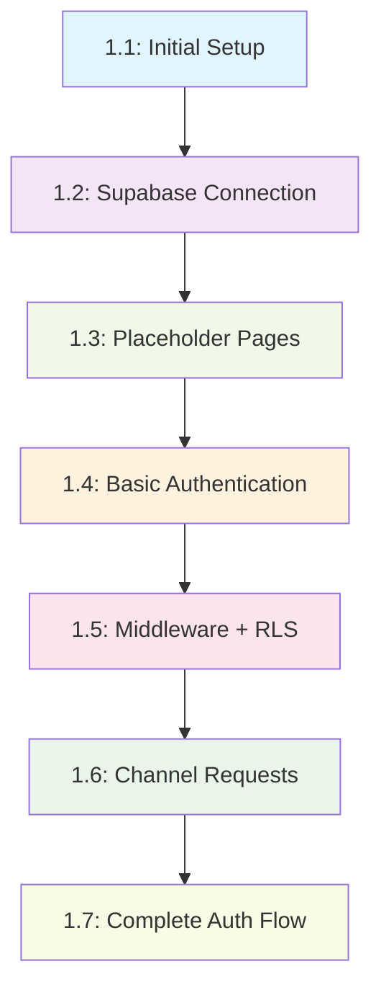

# EPIC 1: Foundation and Authentication

## Business Objective

Establish the foundational infrastructure and authentication system that enables users to:
- Access the BetLink platform with secure authentication
- Navigate to role-appropriate areas based on their permissions (Master, Admin, Tipster, Cliente)
- Experience a working platform foundation that demonstrates the complete tech stack
- Enable future features to build upon a solid authentication and routing foundation

## Success Criteria

### Technical Success
- [ ] Next.js 15 with TypeScript fully operational
- [ ] Tailwind CSS + shadcn/ui design system working
- [ ] Supabase database connected with proper schema
- [ ] Authentication flow working for all user roles
- [ ] Role-based access control (RBAC) implemented with middleware
- [ ] All placeholder pages accessible to appropriate roles

### User Experience Success  
- [ ] Users can register and login seamlessly
- [ ] Each user type sees their appropriate dashboard/interface
- [ ] Navigation is intuitive and role-appropriate
- [ ] Session persistence works across browser refreshes
- [ ] Logout functionality works correctly

### Business Success
- [ ] Platform demonstrates professional UX/UI
- [ ] Foundation supports all planned features in future EPICs
- [ ] No security vulnerabilities in authentication flow
- [ ] Ready for tipster onboarding and client acquisition

## Features Included

### 1. Feature 1.1: Initial Setup - Hello BetLink
**Objective**: Demonstrate working tech stack and project foundation
- **Dependencies**: None (first feature)
- **Deliverable**: Styled homepage showing "Hello BetLink" with tech stack showcase
- **Test**: Page loads at localhost:3000 with proper styling

### 2. Feature 1.2: Supabase Connection + Mock Users Display  
**Objective**: Establish database connectivity and display dynamic data
- **Dependencies**: Feature 1.1 complete
- **Deliverable**: Homepage displays mock users fetched from Supabase
- **Test**: 4 mock users (master, admin, tipster, client) visible on homepage

### 3. Feature 1.3: Role-Based Placeholder Pages
**Objective**: Create navigation structure and role-appropriate landing pages
- **Dependencies**: Feature 1.2 complete
- **Deliverable**: Navigation menu + placeholder pages for each role
- **Test**: Click navigation links and see different pages for each role

### 4. Feature 1.4: Basic Authentication
**Objective**: Implement login functionality with role-based redirects
- **Dependencies**: Feature 1.3 complete  
- **Deliverable**: Login form with Supabase Auth integration
- **Test**: Login with each mock user, verify correct page redirects

### 5. Feature 1.5: Middleware + RLS for Users
**Objective**: Secure routes and implement Row Level Security
- **Dependencies**: Feature 1.4 complete
- **Deliverable**: Protected routes + RLS policies + logout functionality
- **Test**: Attempt to access wrong pages after login, verify blocked access

### 6. Feature 1.6: Expand Schema + Channel Requests
**Objective**: Add tipster channel request functionality
- **Dependencies**: Feature 1.5 complete
- **Deliverable**: Channel request form + admin approval interface
- **Test**: Submit request as tipster, view pending requests as admin

### 7. Feature 1.7: Complete Auth Flow
**Objective**: Full authentication system with all flows
- **Dependencies**: Feature 1.6 complete
- **Deliverable**: Registration, password reset, email confirmation, first-login flows
- **Test**: Complete signup and reset workflows for all user types

## Dependencies Between Features

## MCP Integration Strategy

### context7 MCP Usage
- **Feature 1.2+**: Lookup Supabase best practices and schema patterns
- **Feature 1.4+**: Next.js authentication patterns and security guidelines
- **Feature 1.5+**: Row Level Security (RLS) policy examples
- **Feature 1.7**: Email authentication flow documentation

### supabase MCP Usage  
- **Feature 1.2**: Create profiles table with direct Supabase operations
- **Feature 1.4**: Configure Supabase Auth settings
- **Feature 1.5**: Implement RLS policies via MCP
- **Feature 1.6**: Create solicitacoes_canais table
- **Feature 1.7**: Advanced auth configuration

### playwright MCP Usage
- **All Features**: Automated testing of each feature's functionality  
- **Feature 1.4+**: End-to-end authentication flow testing
- **Feature 1.5**: Access control testing across different user roles
- **EPIC Completion**: Full user journey testing from registration to dashboard access

## Risks and Mitigations

| Risk | Impact | Probability | Mitigation |
|------|--------|-------------|------------|
| Supabase RLS complexity | High | Medium | Start with simple policies, use context7 MCP for examples |
| Next.js middleware auth conflicts | High | Low | Follow Next.js 15 auth patterns, test incrementally |
| User role confusion in UI | Medium | Medium | Clear visual indicators, consistent navigation patterns |
| Session persistence issues | Medium | Low | Use Supabase SSR package correctly |
| Complex auth flows breaking | High | Medium | Implement features incrementally, test each flow |
| Mock data not realistic enough | Low | Medium | Create representative user profiles matching real use cases |

## Phase Structure

### Phase 1: Foundation (Features 1.1-1.2) 
**Goal**: Working tech stack with database connectivity
- **Duration**: 2-3 hours
- **Key Milestone**: Dynamic data display from Supabase
- **Success Metric**: Homepage shows mock users from database

### Phase 2: Navigation & Basic Auth (Features 1.3-1.4)
**Goal**: User can login and navigate to role-appropriate pages
- **Duration**: 4-5 hours  
- **Key Milestone**: Login working with role-based redirects
- **Success Metric**: Each user type reaches their intended dashboard

### Phase 3: Security & Advanced Auth (Features 1.5-1.7)
**Goal**: Complete secure authentication system
- **Duration**: 6-8 hours
- **Key Milestone**: Full auth flows with proper security
- **Success Metric**: All authentication workflows function correctly

## Total Estimate
- **Features**: 7
- **Estimated time**: 12-16 hours (over 2-3 days)
- **Complexity**: Medium-High (authentication complexity)
- **Risk Level**: Medium (well-established patterns, but auth is always complex)

## Checkpoints & Validation

### Checkpoint 1: After Phase 1 (Features 1.1-1.2)
**Questions to Answer:**
- [ ] Is the infrastructure supporting planned features adequately?
- [ ] Do we need additional mock data for testing?
- [ ] Are there any dependencies we didn't anticipate?
- [ ] Is the feature list still accurate for the remaining phases?

**Decision Point**: Continue as planned / Adjust remaining features

### Checkpoint 2: After Phase 2 (Features 1.3-1.4)  
**Questions to Answer:**
- [ ] Is the authentication flow intuitive for users?
- [ ] Are role-based redirects working as expected?
- [ ] Do we need to modify any UI patterns established?
- [ ] Are there integration issues with Supabase Auth?

**Decision Point**: Continue as planned / Refine auth UX

### Checkpoint 3: EPIC Completion (After Feature 1.7)
**Questions to Answer:**
- [ ] Are all authentication flows working end-to-end?
- [ ] Is the security implementation adequate for production?
- [ ] Are all user roles properly supported?
- [ ] Is documentation complete for handover to EPIC 2?

**Decision Point**: EPIC complete / Additional refinement needed

## Integration with Other EPICs

### EPIC 2: Channel Discovery (Public Area)
**Handover Requirements:**
- Working authentication system
- Role-based access control
- User session management
- Protected route middleware

### EPIC 3: Tipster Central  
**Handover Requirements:**
- Tipster role authentication
- Channel request system (Feature 1.6)
- Admin approval workflows
- Secure tipster dashboard access

### EPIC 4: Administrative Panel
**Handover Requirements:**
- Admin/Master role authentication
- User management foundation
- Security policies in place
- Admin dashboard structure

## Documentation Deliverables

### Progress Tracking
- **Primary**: `epic-1-authentication-progress.md` 
- **Features**: Individual feature progress files in `.feature-plans/`
- **Daily Updates**: Progress logged in EPIC progress file

### Technical Documentation
- **Database Schema**: Document tables and RLS policies created
- **Auth Patterns**: Document authentication flows implemented  
- **Component Library**: Document reusable auth components created
- **API Patterns**: Document API routes and middleware patterns

### Handover Documentation
- **To EPIC 2**: Current system state, available APIs, security patterns
- **Component Catalog**: Reusable components for future features
- **Learning Log**: What worked well, problems encountered, recommendations

---

**Created**: 2025-07-21  
**Status**: Ready for Implementation  
**Progress File**: `epic-1-authentication-progress.md`