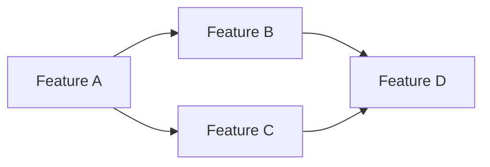

# BetLink - Epic Workflow

## 📚 What is an EPIC?

An EPIC is a cohesive set of features that deliver a complete system capability. Each EPIC has a clear business objective and is composed of features that, together, allow users to complete a full journey.

**Example**: The "Authentication System" EPIC includes features: Initial setup, Login screen, Registration screen, Route protection, and Session management.

---

## 🎯 EPIC Workflow

### **1️⃣ EPIC DEFINITION & PROGRESS TRACKING SETUP**

#### Create EPIC Progress File
**IMPORTANT**: At the start of each EPIC, create a dedicated progress tracking file:

```bash
# Create the progress tracking file
touch epic-[number]-[name]-progress.md
```

**Example**: `epic-1-authentication-progress.md`

This file will track:
- Feature completion status
- Daily progress updates
- Blockers and decisions
- Mock data created/removed
- Integration test results

#### EPIC Definition Template
```markdown
# EPIC: [EPIC Name]

## Business Objective
[What does this EPIC enable users to do?]

## Success Criteria
[How do we know the EPIC is complete and working?]

## Features Included
1. Feature A: [Name] - [Objective]
2. Feature B: [Name] - [Objective]
3. Feature C: [Name] - [Objective]
...

## Dependencies Between Features


## Risks and Mitigations
| Risk | Impact | Mitigation |
|------|--------|------------|
| [Risk 1] | High/Medium/Low | [How to prevent] |

## Total Estimate
- **Features**: X
- **Estimated time**: Y days
- **Complexity**: Low/Medium/High

## Progress Tracking
📁 **Progress File**: `epic-[number]-[name]-progress.md`
```

### **2️⃣ EPIC PROGRESS FILE TEMPLATE**

Create `epic-[number]-[name]-progress.md` with this structure:

```markdown
# EPIC [Number]: [Name] - Progress Tracking

## 📊 Overall Status
- **Start Date**: [Date]
- **Target End Date**: [Date]
- **Current Status**: 🟦 In Progress
- **Progress**: 0/X features completed (0%)

## 🎯 Features Checklist

### Phase 1: Foundation
- [ ] Feature 1.1: [Name] - No dependencies
  - **Status**: ⏳ Pending
  - **Estimated**: X hours
  - **Actual**: - hours
  - **Notes**: -

- [ ] Feature 1.2: [Name] - No dependencies
  - **Status**: ⏳ Pending
  - **Estimated**: X hours
  - **Actual**: - hours
  - **Notes**: -

### Phase 2: Core
- [ ] Feature 2.1: [Name] - Depends on 1.1
  - **Status**: ⏳ Pending
  - **Estimated**: X hours
  - **Actual**: - hours
  - **Notes**: -

### Phase 3: Refinement
- [ ] Feature 3.1: [Name] - Depends on all previous
  - **Status**: ⏳ Pending
  - **Estimated**: X hours
  - **Actual**: - hours
  - **Notes**: -

## 🔄 Daily Updates

### [Date] - Day 1
- **Started**: Feature 1.1
- **Completed**: -
- **Blockers**: -
- **Mocks Created**: -
- **Next**: Continue Feature 1.1

### [Date] - Day 2
- **Started**: -
- **Completed**: Feature 1.1
- **Blockers**: -
- **Mocks Created**: Test users for authentication
- **Next**: Start Feature 1.2

## 🧪 Mock Data Tracking
- [ ] Mock user accounts (admin, tipster, client)
- [ ] Test database with sample data
- [ ] Placeholder API responses
- [ ] Mock email sending

## 🚧 Blockers & Decisions
| Date | Blocker/Decision | Resolution | Impact |
|------|------------------|------------|---------|
| [Date] | [Description] | [How resolved] | [Time lost] |

## 🎯 Checkpoints

### Checkpoint 1 (After Phase 1) - [Date]
- [ ] Infrastructure supports planned features?
- [ ] Need additional mock data?
- [ ] Feature list still accurate?
- [ ] Any new dependencies discovered?
- **Decision**: Continue as planned / Adjust features
- **Notes**: 

### Checkpoint 2 (After Phase 2) - [Date]
- [ ] Core functionality working?
- [ ] Integration issues found?
- [ ] Mocks adequate for testing?
- [ ] Need to modify remaining features?
- **Decision**: Continue as planned / Adjust features
- **Notes**: 

### Final Checkpoint (Before completion) - [Date]
- [ ] All features working together?
- [ ] E2E test passing?
- [ ] Documentation complete?
- [ ] Ready for next EPIC?
- **Decision**: EPIC complete / Need refinement
- **Notes**: 

## 📚 Documentation Links
- [Feature 1.1 documentation](link)
- [Feature 1.2 documentation](link)
- [Integration test results](link)
- [Handover document](link)
```

### **3️⃣ FEATURE SEQUENCING**

```markdown
## Implementation Order - EPIC: [Name]

### Phase 1: Foundation
- [ ] Feature 1.1: [Name] - No dependencies
- [ ] Feature 1.2: [Name] - No dependencies

### Phase 2: Core
- [ ] Feature 2.1: [Name] - Depends on 1.1
- [ ] Feature 2.2: [Name] - Depends on 1.1 and 1.2

### Phase 3: Refinement
- [ ] Feature 3.1: [Name] - Depends on all previous

## Checkpoints
- **Checkpoint 1** (after Phase 1): [What should be working]
- **Checkpoint 2** (after Phase 2): [What should be working]
- **Final** (after Phase 3): [Complete EPIC]
```

### **4️⃣ EPIC INTEGRATION TESTING**

Unlike isolated feature tests, EPIC testing validates the complete journey:

```markdown
## E2E Test for EPIC: [Name]

### Main Scenario
**As**: [User type]
**I want**: [Main action]
**So that**: [Benefit]

### Test Journey
1. [Step 1 - Feature A]
2. [Step 2 - Feature B]
3. [Step 3 - Feature C]
...
N. [Final validation]

### Acceptance Criteria
- [ ] Complete journey without errors
- [ ] Total time < X seconds
- [ ] Data persisted correctly
- [ ] Consistent states
```

### **5️⃣ EPIC COMPLETION & HANDOVER**

```markdown
## EPIC Summary: [Name]

### What was delivered
- ✅ [Capability 1]
- ✅ [Capability 2]
- ✅ [Capability 3]

### How to use
[Brief guide for developers about new capabilities]

### APIs/Interfaces created
- `POST /api/[endpoint]` - [Description]
- Hook `use[Name]` - [Description]
- Component `<[Name] />` - [Description]

### Architectural decisions
[Key decisions that affect the system as a whole]

### Technical debt identified
[What can be improved in the future]
```

---

## 📊 Practical Example: Authentication System EPIC

### 1. Create Progress File
```bash
touch epic-1-authentication-progress.md
```

### 2. EPIC Definition
```markdown
# EPIC: Authentication System

## Business Objective
Allow users to create accounts, log in, and access protected areas according to their permissions (client/tipster/admin/master).

## Success Criteria
- Users can create accounts and log in
- Routes are protected by role
- Session persists between reloads
- Logout works correctly

## Features Included
1. Feature 1: Supabase Auth Setup - Configure authentication
2. Feature 2: Login Screen - Entry interface
3. Feature 3: Registration Screen - Create new account
4. Feature 4: Protection Middleware - Protect routes
5. Feature 5: Session Management - Keep user logged in

## Progress Tracking
📁 **Progress File**: `epic-1-authentication-progress.md`
```

---

## 🔄 How to Update Progress

### When Starting a Feature
```markdown
### [Date] - Day X
- **Started**: Feature 1.1: Supabase Auth Setup
- **Status**: 🟦 In Progress
- **Completed**: -
- **Blockers**: -
- **Next**: Continue setup, create test users
```

### When Completing a Feature
```markdown
### [Date] - Day X
- **Started**: -
- **Completed**: ✅ Feature 1.1: Supabase Auth Setup
- **Status**: Complete
- **Time**: 4 hours (estimated 3 hours)
- **Mocks Created**: Test user accounts
- **Next**: Start Feature 1.2: Login Screen
```

### When Blocked
```markdown
### [Date] - Day X
- **Started**: Feature 1.2: Login Screen
- **Completed**: -
- **Blockers**: ❌ Supabase RLS policies not working
- **Status**: Blocked
- **Next**: Debug RLS policies, may need to adjust schema
```

---

## 🚀 EPIC Workflow Benefits

1. **Clear vision**: Everyone knows the bigger objective
2. **Prioritization**: Features in correct order
3. **Incremental validation**: Checkpoints ensure quality
4. **Less rework**: Dependencies mapped
5. **Natural documentation**: Knowledge consolidated
6. **Progress transparency**: Real-time tracking of status
7. **Historical record**: Decisions and learnings documented